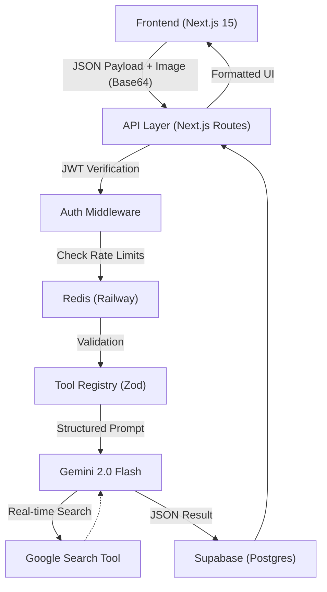

# ⚽ FC xManager (FIFA AI) 🧠

[](https://nextjs.org/)
[](https://deepmind.google/technologies/gemini/)
[](https://www.typescriptlang.org/)
[](https://www.prisma.io/)

**FC xManager** is a high-performance, structured AI execution engine designed for hardcore EA Sports FC (FIFA) players. This is not a chatbot; it is a deterministic analytical platform that provides elite-level tactical and financial intelligence.

---

## 🏗️ System Architecture

FC xManager leverages a modern, decoupled architecture to ensure sub-second latency and high reliability.



---

## 🔥 Key Features

The platform is divided into two specialized operating environments: **The Lab** and **The Boardroom**.

### 🧪 The Lab (Tactical & Market Intelligence)
*   **Investment Whale**: Real-time market trend analysis and card flipping recommendations.
*   **Transfer Scout**: Find meta-relevant, budget-friendly alternatives for any player.
*   **SBC Solutionist**: Cheapest SBC solutions using your club's specific inventory.
*   **Evo-Path Optimizer**: Map the statistical "end-game" for your favorite evolution cards.
*   **Tactics Simulator**: Custom tactical instructions and slider values based on your playstyle.
*   **Post-Match Reviewer**: Upload match stats for a deep-dive analysis of your performance.

### 💼 The Boardroom (Career Mode Strategy)
*   **Wonderkid Whisperer**: detect high-growth prospects before they hit the global radar.
*   **Realism Enforcer**: Algorithmic constraints to keep your transfers grounded in reality.
*   **Storyline Generator**: Dynamic narrative arcs to deepen your club's lore.
*   **Financial Auditor**: Track revenue, wage-to-turnover ratios, and transfer profits.
*   **Manager Persona AI**: Develop a unique coaching identity that influences squad morale.
*   **Sister Club Scout**: Manage global affiliate networks for talent development.

---

## 🛠️ Technology Stack

| Layer | Technology |
|---|---|
| **Frontend** | React 19, Next.js 15 (App Router), Framer Motion, Tailwind CSS, Lucide Icons |
| **Backend** | Node.js, Next.js API Routes, TypeScript |
| **AI Engine** | Gemini 2.0 Flash (Multimodal + Google Search Tool) |
| **Database** | PostgreSQL via Supabase |
| **Caching** | Redis via Railway |
| **Validation** | Zod (High-precision schema enforcement) |
| **ORM** | Prisma |

---

## 🚀 Getting Started

### Prerequisites

*   Node.js 18.x or higher
*   Supabase Account (for PostgreSQL)
*   Railway Account (for Redis)
*   Google AI Studio Key (for Gemini 2.0 Flash)

### Installation

1.  **Clone the repository:**
    ```bash
    git clone https://github.com/yourusername/fifa-ai.git
    cd fifa-ai
    ```

2.  **Install dependencies:**
    ```bash
    npm install
    ```

3.  **Configure Environment Variables:**
    Create a `.env.local` file with the following:
    ```env
    DATABASE_URL="your-supabase-url"
    REDIS_URL="your-redis-url"
    GEMINI_API_KEY="your-gemini-key"
    JWT_SECRET="your-secret"
    ```

4.  **Database Sync:**
    ```bash
    npx prisma db push
    ```

5.  **Run Development Server:**
    ```bash
    npm run dev
    ```

---

## 🎨 Design Philosophy

FC xManager focuses on a **Premium Dark Aesthetic**.
*   **Neon Accents**: Tactical Green (`#00FF41`) and Executive Gold (`#EAB308`).
*   **Modular Forms**: Custom animated input forms that handle multimodal (image) uploads.
*   **Glassmorphism**: Backdrop blurs and high-inertia UI elements for a state-of-the-art feel.

---

## 📄 License

This project is licensed under the MIT License - see the [LICENSE](LICENSE) file for details.

---

<p align="center">Made with ❤️ for the FC Community</p>
